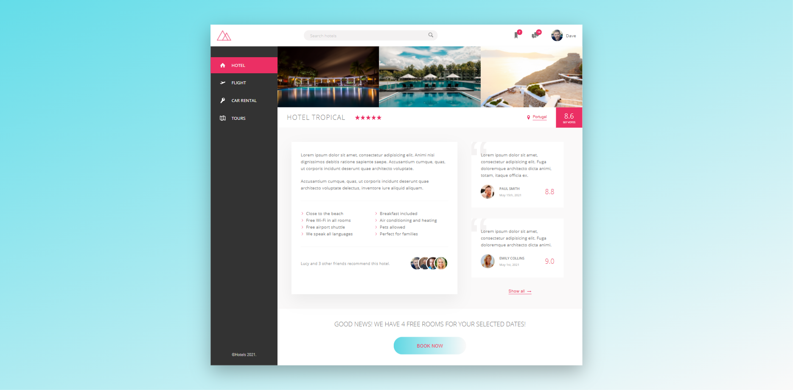
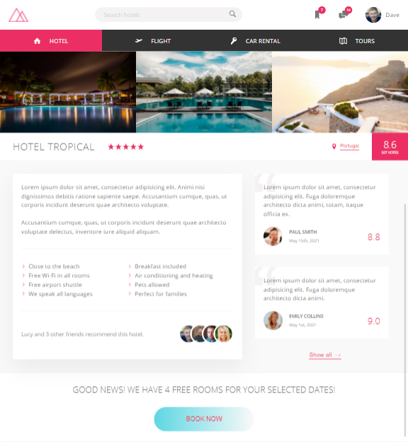

# Onlineshop

This project uses SASS, BEM naming convention, HTML and npm to create a responsive fictional travel website.

No bootstrap was used for the layout only flex box and Sass.

The page is responsive and include some CSS animations on the buttons when you click or hover over them and animated caption that appears when you hover over the gallery photos.

## To see the webpage deployed click the link below

https://rdm100.github.io/flex-box-sass-practice/

## To run application
To run the application locally you will need to have Node installed.

After cloning the repository navigate to the console/terminal to the root directory and run the command npm install and then npm run start

This should open your browser to `http://127.0.0.1:8080/` where you can see the web page.

## Screenshots

Desktop view

Laptop view

Smaller laptop view

Tablet view

Mobile view

